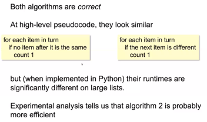

# Complexity Alaysis | Fri 9 Aug

## Count distinct items in non-decreasing list

1. Comparison requires full implementation of each algorithm
2, Performance depends on the implementation in a particular language
3. Comparison requires testing in same software and hardware environment

### What does 'work done' mean?
 will consider the following *basic steps*
- reading the value of a variable
- assigning a value to a variable
- simple arithmetic operations ( ie. adding two numbers)
- comparing values
- calling a function ( basically a jump )
- basically everything else

## Worst-Case upper bound
The num of steps will vary depending on the values in the input, but may grow in a pattern dependent on the *size* of the input

Can we find a worst-case upper-bound on the num of steps?

As the inputs grows past a certain size, we want a guaruntee that the number...

## Big-Oh notation
The *log* of a number is the power to which the base must be raised to give the number