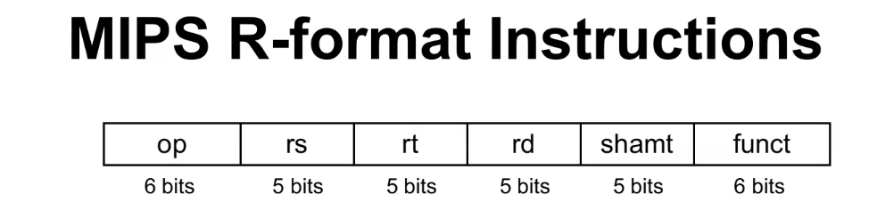

# CPU Time Example
Computer A: 2GHz clock, 10s CPU time

Designing Computer B
- Aiming for 6s CPU Time
- Can do faster clock, but causes 1.2 x clock cycles

## How fast must computer B's clock rate be?
$$
Clock Rate = Clock Cycles) (CPU Time) = 1.2 x \frac{Clock Cycles}{6s}

CLock Cycles(a) = CPU Time 
$$

## CPI Example (clocks per instruction)
Computer A: Cycle Time = 250ps, CPI= 2.0
Computer B: Cycle Time = 500ps, CPI = 1.2

    - Same ISA
    - Which is faster and by how much?

### Time and throughput are the main performance benchmark

#### To say one computer is better than another is by comparing the execution time

## Performance 
Time is the only complete and reliable measure of performance

    Performance depends on 
        - algorithm: affects IC, possibly CPI
        - Programming language: affects IC, CPI
        - Compiler: affects IC, CPI
        - ISA: affects IC, CPI, T(c) [clock cycle]

## Mips Arithmetic Operations
### Assembly instruction operands are neither registers or memory operands

    $a=b + c$ add $t0, $S1, $s2 --> t0 = S1 + S2
MIPS arithmetic instructions ONLY use register operands

Register Format Instruction R-Format

MIPS instructions have a fixed size of 32bits
Instruction format defines the fields included in instructions

MIPS has three instruction formats
1. R-Format
2. I-Format
3. J-Format

## multiplying can be signed (mult) or unsigned (multu) --> these need 2 destinations because the answer can be up to 64 bits long
